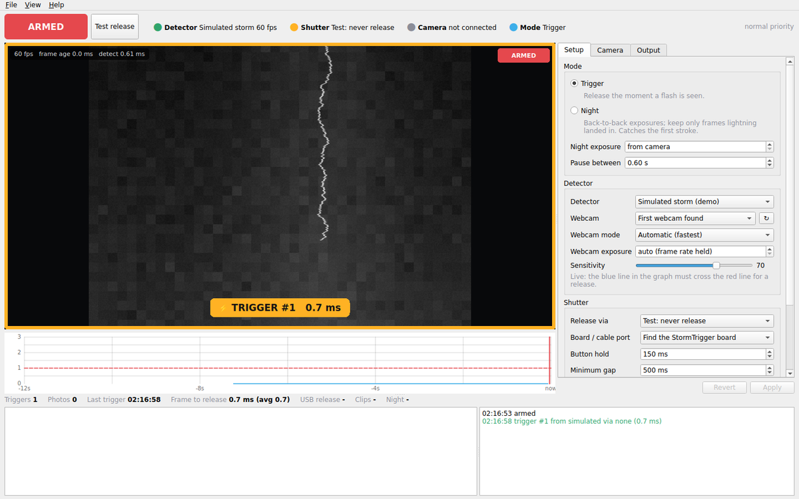

# StormWatch

Lightning trigger for the **Nikon D3300** on **Linux** (built for Fedora KDE Plasma).
It watches the sky and releases the shutter the moment a flash begins: from a
webcam frame to the release command in under a millisecond of processing, or in
under 0.06 ms with the optional photodiode board, which fires the camera by itself.



## How fast is it?

| Detector → release path | Time added before the camera | Extra hardware |
|---|---|---|
| **Photodiode → StormTrigger board** (fires in its ADC interrupt) | **< 0.06 ms** | Arduino + photodiode + MC-DC2 cable |
| Webcam → StormTrigger remote cable | 1 frame (≤ 16.7 ms at 60 fps) + ~0.5 ms | webcam + Arduino + MC-DC2 cable |
| Webcam → USB cable (one PTP transaction) | 1 frame + ~0.5 ms + a few ms of USB | webcam |
| D3300 live view → USB cable | tens of ms (slowest) | none |

After that comes the D3300's own shutter lag (on the order of a tenth of a
second), which no software or trigger can remove. So the stroke that *triggers*
the camera is usually over before the shutter opens; you get the strokes that
follow and the lit cloud. Two things cover the rest:

- **Detector clips**: the webcam frames around each trigger are saved. The
  trigger frame *is* the first stroke.
- **Night mode** keeps the shutter open in back-to-back exposures and keeps only
  the frames a flash landed in. That is how the first stroke gets onto the D3300's
  sensor.

## Install (Fedora)

```bash
git clone https://github.com/mihaelniko/stormwatcher.git
cd stormwatcher
packaging/install.sh            # add --realtime and/or --no-gvfs, see below
```

This installs `python3-pyside6`, `python3-gphoto2`, `python3-numpy` and
`python3-pillow` with dnf, the app to `~/.local/share/stormwatch`, the
`stormwatch` command to `~/.local/bin`, a menu entry, and udev rules that:

- stop the camera's USB link from autosuspending (no wake-up delay before a release),
- let you open the camera and the trigger board without joining `dialout`,
- keep ModemManager from probing the Arduino while it boots,
- cut FTDI USB-serial latency from 16 ms to 1 ms.

Options: `--realtime` lets the detection thread run at real-time priority
directly (log out and back in afterwards; without it StormWatch asks RealtimeKit,
which already works on most desktops). `--no-gvfs` stops GNOME's gvfs from
grabbing the camera whenever it is plugged in.

Unplug and replug the camera once after installing. Then start **StormWatch**
from the menu, or:

```bash
stormwatch                 # the app
stormwatch --demo          # try it without any hardware (simulated storm)
stormwatch --list-devices  # what it can see: webcams, serial ports, cameras
```

## Setting up the D3300

1. **Lens switch on M**, focused at infinity. Autofocus is the largest avoidable
   delay, and it hunts in the dark. (StormWatch also sends releases with
   autofocus disabled, and warns you if the lens is on AF.)
2. **Mode dial on M**, with shutter, aperture and ISO set for the light, so the
   camera never pauses to meter.
3. **SD card in.** Photos are written to the card and copied to the PC in the
   background, so a release never waits for a download.
4. Release mode **Single**. With the remote cable, **Continuous** plus a longer
   "button hold" gives a burst per trigger.
5. Connect the USB cable and switch the camera on. It is found automatically.

## What you need

**Minimum:** the D3300, its USB cable, and any USB webcam pointed at the same sky.
The release goes over USB. Without a webcam, the D3300's own live view can be
the detector, but that is the slowest option.

**Fastest: the StormTrigger board.** An Arduino Uno or Nano, two PC817
optocouplers, a phototransistor, three resistors, and a cheap wired MC-DC2
remote cable to cut up for its plug:

```
 5V ──┬── phototransistor (C)          D2 ──[330Ω]──► PC817 #1 LED ── GND
      │   phototransistor (E) ──┬─ A0  D3 ──[330Ω]──► PC817 #2 LED ── GND
      │                       [10kΩ]
      │                         │      PC817 #1 output: collector → SHUTTER wire, emitter → GND wire
 GND ───────────────────────────┘      PC817 #2 output: collector → FOCUS wire,   emitter → GND wire
```

To find the three wires of the remote cable, use a multimeter in continuity
mode: a half press connects FOCUS to GND, a full press also connects SHUTTER.
A bigger resistor on the phototransistor makes it more sensitive (try 4.7 kΩ in
daylight and 22 kΩ at night). The optocouplers keep the camera electrically
isolated from the Arduino.

Flash `firmware/stormtrigger/stormtrigger.ino` with the Arduino IDE (Flathub:
`cc.arduino.IDE2`) or arduino-cli:

```bash
arduino-cli compile --fqbn arduino:avr:uno firmware/stormtrigger
arduino-cli upload  --fqbn arduino:avr:uno -p /dev/ttyACM0 firmware/stormtrigger
```

(Nano clones usually need `arduino:avr:nano:cpu=atmega328old`.) Set
`AUTO_AT_BOOT` to 1 in the sketch to run the board with no PC at all, from a
power bank.

A plain USB-serial adapter driving the two optocouplers from DTR and RTS also
works ("USB-serial remote cable"). It's cheaper, but has no photodiode.

## Using it

- **Arm** (`Ctrl+Space`). The graph shows the detector score over the last 12 s.
  The blue line idles near 0 and jumps over the red line (1.0) when the sky
  flashes. **Sensitivity** applies live.
- **Test release** (`Ctrl+T`) fires the camera once, to check the chain.
- **Trigger** mode releases on every flash, with a minimum gap between releases.
  **Night** mode fires a steady rhythm (exposure + 0.35 s + the pause you set)
  and sorts each frame into `lightning/` or `no-lightning/` by whether a flash
  happened during *that* exposure. Nothing is deleted.
- The Camera tab shows the D3300's battery, mode dial and focus mode, and sets
  shutter, aperture, ISO, quality and release mode directly on the body.
- Photos land in `~/Pictures/StormWatch/<date>/` (the date rolls over at noon,
  so one storm night stays in one folder), detector clips in `clips/`.
  Double-click a thumbnail to open it.
- `View → Dark theme` keeps your night vision.

Headless, for example over SSH:

```bash
stormwatch --headless --arm
stormwatch --headless --arm --set mode=night --set night_exposure_s=4
```

Settings live in `~/.config/stormwatch/settings.json`, shared by the app and
headless mode.

## Troubleshooting

| Symptom | Fix |
|---|---|
| Banner "held by gvfsd-gphoto2" (or another app) | Click **Release camera**. To stop it for good: `packaging/install.sh --no-gvfs`. |
| Camera "no permission" | Run `packaging/install.sh` (udev rules), then replug the camera. |
| The laptop's built-in camera is the detector | Plug in the USB webcam and choose it under Setup → Webcam. External cameras are preferred automatically. |
| Webcam frame rate drops in the dark | StormWatch already stops auto exposure from slowing the frame rate. If it still pumps, set a manual webcam exposure. |
| "No StormTrigger firmware answered" | Flash the firmware; check `stormwatch --list-devices`. |
| Releases ignored with live view + remote cable | The D3300 may ignore the remote in live view. Use USB release with that detector. |
| "Scheduling: normal priority" | Install rtkit (`sudo dnf install rtkit`) or run `install.sh --realtime` and log in again. |
| False triggers | Lower Sensitivity; lock the webcam exposure; keep car headlights and blinking lights out of the frame. |

## How it works

- **Two processes.** The window never touches a device. A separate engine
  process owns the camera, webcam and serial ports, so painting the UI can never
  delay a release. It dies with the UI (`PR_SET_PDEATHSIG`).
- **Hot path.** Kernel V4L2 buffer → luminance read in place (no decode for
  YUYV/NV12/GREY) → detector (~0.4 ms) → shutter. Clips, preview and telemetry
  only run after the release has been issued. The detection thread runs at
  real-time priority (SCHED_FIFO, or SCHED_RR via RealtimeKit), the GC is held
  off while armed, and the CPU is kept out of deep idle while armed when
  permitted.
- **Webcam.** Direct `ioctl` + `mmap` V4L2 with a three-buffer ring, always the
  newest frame, kernel `CLOCK_MONOTONIC` timestamps, highest frame rate first,
  and `exposure_auto_priority=0` so the frame rate holds in the dark. The Python
  structs are checked against the kernel headers by the tests.
- **Detector.** Per-pixel background and noise model on a block-averaged image.
  A flash is a coherent, sudden onset: lit above background, jumped since the
  last frame after removing global drift, and with lit neighbours. This
  separates lightning from noise, twinkling lights, clouds, dusk and
  auto-exposure ramps, and catches every stroke of a multi-stroke flash.
- **USB release.** One PTP transaction, Nikon `InitiateCaptureRecInMedia` with
  autofocus disabled, through libgphoto2's raw opcode widget. A busy camera is
  retried every 2 ms. It falls back to libgphoto2's `trigger_capture()`
  automatically if the body or the library build does not take that path.
  Downloads are read in 1 MB chunks, and a release request is served between
  chunks.
- **StormTrigger.** A free-running 19 kHz ADC interrupt with an adaptive trip
  level. It is edge-triggered, so lasting light releases once, never repeatedly.
  It drives the optocouplers by direct port writes, and holds FOCUS while armed so
  the D3300 never sleeps.

## Development

```bash
python3 -m pytest
```

The suite covers the detector, the V4L2 ABI (compiled against
`linux/videodev2.h`), V4L2 streaming against a fake driver, the Arduino protocol
over a real pseudo-terminal, and the firmware itself (compiled for the PC and
driven sample by sample). It also runs the camera worker against a simulated
D3300 (`tests/fake_gphoto2.py`, checked against the real python-gphoto2 API),
night-mode matching, the engine end to end, the engine process, the headless CLI
and the window (offscreen). Set `STORMWATCH_ARDUINO_CORE` to an
[ArduinoCore-avr](https://github.com/arduino/ArduinoCore-avr) checkout to also
build the firmware for the ATmega328P.

**Tested how:** everything above runs in the test suite. The D3300-specific
USB behaviour follows libgphoto2's Nikon driver (`camlibs/ptp2`). It was
exercised against a simulated camera, not yet on a physical D3300, so a first
night out is worth a `Test release` and a look at the log.

The old Raspberry Pi webcam client/server and the Windows digiCamControl script
were replaced by this app. They are still in the git history.
